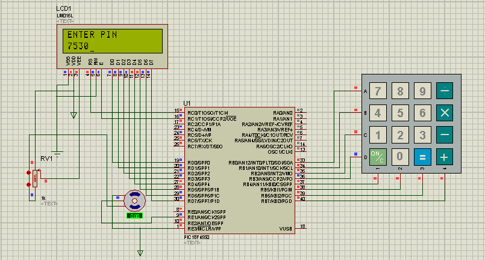
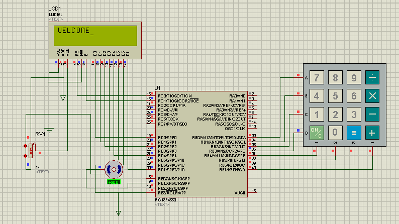

# Door Lock System PIC

## Objective
Design lock door system which uses a keypad for entering the password, servo to rotate the door and lcd to ask for pin and print the feedback.

## Equipment
-	PC, MPLAB, Proteus
-	PIC 18f4550
-	Breadboard, Wires
-	Servo motor
-	LCD lm016
-	Keypad
-	10k potentiometer, 330 ohms resistor

## Description
In this project, the lcd will show “ENTER PIN”, and the MCU will start scanning through the keypad for four strokes. 
The MCU will then compare the entered password with the real one which is “7530”; 
if it is true the lcd will print “WELCOME” and the servo will rotate by 90(door unlock), wait for few seconds, then return it back to 0 (lock automatically). 
Then the pic will ask for the pin again and scan the keypad for a pin.
## Procedure 
-	Connect the following circuit
-	Enter the pin

## Results 

